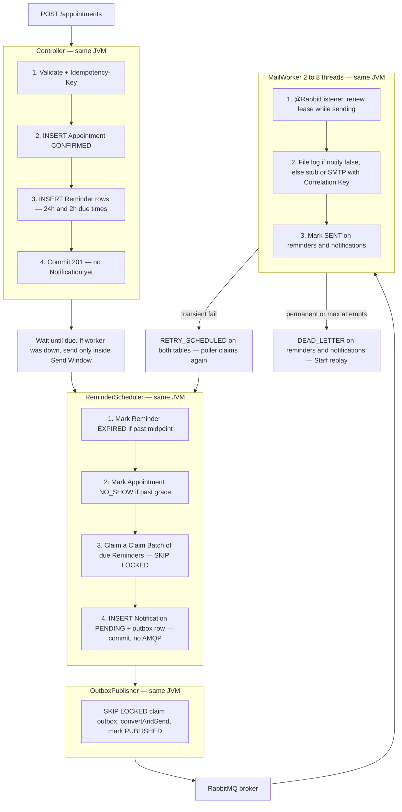
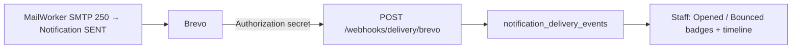

# Dealership Appointment API

Vehicle-service **Appointment** booking, **Reminder** delivery, and **email tracking** (Delivery Events: opened / bounce). Modular Spring Boot monolith.

Production staff login is the seed user **`staff@greatnerve.com` / `password1`**.

Design docs: [github.com/GreatNerve/Dealership-Backend/tree/main/docs](https://github.com/GreatNerve/Dealership-Backend/tree/main/docs). Test inventory: [test-report.md](test-report.md) · [GitHub](https://github.com/GreatNerve/Dealership-Backend/blob/main/test-report.md).

Protected `/api/v1` routes need **`Authorization: Bearer <token>`** after login (Swagger **Authorize**, OAuth2 password, username = email).

## Reminder send window

This window exists **because if the worker goes down and then recovers**, mail can still go out. Due time is when it should send. If the worker was down at that instant, after it comes back it may send while `now` is still in the first half of the gap to the next due. If it recovers **past the midpoint** → `EXPIRED`, no mail for that offset (a 24h Reminder must not send an hour before the visit).

Adjacent gap ÷ 2. Remaining time to the next due **greater than** half the gap → send. Remaining **≤ half** → no mail for that offset. Visit at **T**. Default `24h,2h`.

| Reminder | Due | Gap to next | Midpoint | Notification may send | After that |
| --- | --- | --- | --- | --- | --- |
| 24h | T−24h | 22h (to 2h) | **T−13h** | **T−24h → T−13h** | `EXPIRED`, no 24h mail |
| 2h | T−2h | 2h (to visit) | **T−1h** | **T−2h → T−1h** | `EXPIRED`, no 2h mail |

Worker goes down, recovers at T−22h or T−20h → send 24h. Recovers at T−12h → no. Recovers at T−90m → send 2h. Recovers at T−30m → no. Product: [docs/prd/reminder.md](docs/prd/reminder.md). Why: [docs/decision/send-window-and-config.md](docs/decision/send-window-and-config.md). Clock: [docs/trd/time.md](docs/trd/time.md).

## Run locally

Docker Desktop must be running. `make test` and `./mvnw test` start Postgres, RabbitMQ, and Redis with Testcontainers; without Docker those tests fail before any assertion (`Could not find a valid Docker environment`). The git pre-commit hook runs the same tests when `src/` or `pom.xml` changes. Windows PostgreSQL on `5432` must be stopped. Then:

```bash
cp .env.example .env
make hooks
make test
make run
make stop   # free 8080 if a previous JVM is still bound
```

Same without make:

```bash
cp .env.example .env
docker compose -f docker/docker-compose.deps.yml up -d
./mvnw spotless:apply
./mvnw test
./mvnw spring-boot:run
```

App image only (deps + `docker/docker-compose.app.yml`):

```bash
make app
```

Full stack (root `docker-compose.yml` includes deps + app):

```bash
cp .env.example .env
docker compose up -d --build
```

- API: http://localhost:8080/api/v1
- Swagger: http://localhost:8080/swagger-ui.html
- Health: http://localhost:8080/actuator/health
- Prometheus (JWT): http://localhost:8080/actuator/prometheus

Demo login (`dev` profile): `staff@greatnerve.com` / `password1` and `customer@greatnerve.com` / `password1`.

## Try an Appointment (24h and 2h Reminders)

Pass the API URL. Default is both offsets. `24h` / `2h` as a second argument.

```bash
bash scripts/test-appointment.sh http://localhost:8080
bash scripts/test-appointment.sh https://dealership.greatnerve.com
bash scripts/test-appointment.sh http://localhost:8080 24h
bash scripts/test-appointment.sh https://dealership.greatnerve.com 2h
```

Curl-only steps: [manual-appointment.md](manual-appointment.md). `notify: false` writes `logs/notifications.log` locally (prod log stays on the server). Book ~20h out to fire the 24h Reminder now; ~100 minutes out to fire the 2h Reminder. Rate limit is **15 / 60s per endpoint** (never a 15-minute wait).

Default Notification Mode is **stub**. Set `APP_NOTIFICATIONS_MODE=smtp` to send through **Brevo** (host/login/key in `.env`).

## Flow

**One Spring Boot JVM.** PostgreSQL, RabbitMQ, and Redis are the other processes. Reminder poller, `OutboxPublisher`, and `MailWorker` are threads in that JVM — not three app boxes.

The **controller** saves the Appointment and Reminder schedule. `ReminderScheduler` claims due Reminders and writes Notification + outbox (**no AMQP in that transaction**). `OutboxPublisher` drains outbox to RabbitMQ. `MailWorker` (`@RabbitListener`, 2–8 threads) sends. Postgres does not create the booking.



Runtime detail: [docs/architecture.md](docs/architecture.md). Uniqueness: [docs/testing/uniqueness-and-concurrency.md](docs/testing/uniqueness-and-concurrency.md).

## Email tracking (Delivery Events)

**Additional feature** on top of send: worker **SENT** is SMTP 250. Opened, delivered, click, and soft/hard bounce are **Delivery Events** — append-only rows. They do **not** overwrite Notification `SENT` / `DEAD_LETTER`.

SMTP sets Correlation Key = Notification UUID (Brevo header `X-Mailin-custom`). Provider posts `POST /webhooks/delivery/{provider}` with `APP_DELIVERY_WEBHOOK_SECRET` (not User JWT). Unknown Notification → 204. Duplicate provider event id → one row.

Staff see the timeline on `GET /notifications/{id}` (latest first) and on Appointment detail. List flags `opened` / `bounced` come from `EXISTS` on those events. Dashboard Opened / Bounced use the same log (healed `occurred_at`). Channel is **EMAIL** in v1.



Product: [docs/prd/email-tracking.md](docs/prd/email-tracking.md). Tech: [docs/trd/email-tracking.md](docs/trd/email-tracking.md). Why: [docs/adr/0012-smtp-correlation-and-delivery-events.md](docs/adr/0012-smtp-correlation-and-delivery-events.md).

## Docs index

Start with the folder READMEs, then open the file for that topic. Terms live in [CONTEXT.md](CONTEXT.md).

| Index | What it is |
| --- | --- |
| [docs/prd/README.md](docs/prd/README.md) | Product: behaviour, stories, policies |
| [docs/trd/README.md](docs/trd/README.md) | Tech: HTTP, schema, config, stack |
| [docs/decision/README.md](docs/decision/README.md) | Architecture I chose and **why** |
| [docs/architecture.md](docs/architecture.md) | Runtime flows |
| [docs/testing/README.md](docs/testing/README.md) | Unit, integration, e2e, uniqueness |
| [test-report.md](test-report.md) | Last `./mvnw test` counts + unit / e2e inventory |
| [docs/adr/](docs/adr/) | Short ADRs (hard-to-reverse trade-offs) |

| Topic | Product | Tech | Why |
| --- | --- | --- | --- |
| Terms / glossary | — | — | [CONTEXT.md](CONTEXT.md) |
| Problem and goals | [prd/overview.md](docs/prd/overview.md) | [trd/stack.md](docs/trd/stack.md) | [decision/modular-monolith.md](docs/decision/modular-monolith.md) |
| Identity, JWT, login | [prd/identity.md](docs/prd/identity.md) | [trd/identity.md](docs/trd/identity.md) | [adr/0007](docs/adr/0007-jwt-local-users.md) |
| Dealership | [prd/dealership.md](docs/prd/dealership.md) | [trd/dealership.md](docs/trd/dealership.md) | [decision/dual-booking.md](docs/decision/dual-booking.md) |
| Customer | [prd/customer.md](docs/prd/customer.md) | [trd/customer.md](docs/trd/customer.md) | [decision/dual-booking.md](docs/decision/dual-booking.md) |
| Vehicle | [prd/vehicle.md](docs/prd/vehicle.md) | [trd/vehicle.md](docs/trd/vehicle.md) | [decision/one-appointment-per-vehicle.md](docs/decision/one-appointment-per-vehicle.md) |
| Appointment | [prd/appointment.md](docs/prd/appointment.md) | [trd/appointment.md](docs/trd/appointment.md) | [decision/appointment-lifecycle.md](docs/decision/appointment-lifecycle.md), [dual-booking](docs/decision/dual-booking.md) |
| One Confirmed per Vehicle | [prd/appointment.md](docs/prd/appointment.md) | [trd/data-model.md](docs/trd/data-model.md) | [decision/one-appointment-per-vehicle.md](docs/decision/one-appointment-per-vehicle.md), [adr/0006](docs/adr/0006-one-confirmed-appointment-per-vehicle.md) |
| Reminder | [prd/reminder.md](docs/prd/reminder.md) | [trd/reminder.md](docs/trd/reminder.md) | [decision/send-window-and-config.md](docs/decision/send-window-and-config.md) |
| Send window (24h / 2h) | [prd/reminder.md](docs/prd/reminder.md) | [trd/time.md](docs/trd/time.md) | [decision/send-window-and-config.md](docs/decision/send-window-and-config.md) |
| Notification (`stub` / `smtp`, Manual) | [prd/notification.md](docs/prd/notification.md) | [trd/notification.md](docs/trd/notification.md) | [decision/notification-pipeline.md](docs/decision/notification-pipeline.md) |
| Email tracking (Delivery Events) | [prd/email-tracking.md](docs/prd/email-tracking.md) | [trd/email-tracking.md](docs/trd/email-tracking.md) | [decision/notification-pipeline.md](docs/decision/notification-pipeline.md), [adr/0012](docs/adr/0012-smtp-correlation-and-delivery-events.md) |
| Time, Booking Offset, Dealership Timezone | [prd/appointment.md](docs/prd/appointment.md) | [trd/time.md](docs/trd/time.md) | [decision/utc-instant-and-booking-offset.md](docs/decision/utc-instant-and-booking-offset.md), [adr/0011](docs/adr/0011-utc-instant-booking-offset.md) |
| Postgres clock and uniqueness | — | [trd/data-model.md](docs/trd/data-model.md) | [decision/postgres-clock-and-ledger.md](docs/decision/postgres-clock-and-ledger.md), [sql-clock](docs/decision/sql-clock-not-app-layer.md) |
| RabbitMQ outbox | [prd/notification.md](docs/prd/notification.md) | [trd/notification.md](docs/trd/notification.md) | [decision/rabbitmq-outbox-delivery.md](docs/decision/rabbitmq-outbox-delivery.md), [adr/0002](docs/adr/0002-postgres-schedules-rabbit-delivers.md) |
| Redis (HTTP rate limit only) | [prd/operations.md](docs/prd/operations.md) | [trd/rate-limiting.md](docs/trd/rate-limiting.md) | [decision/redis-http-rate-limit.md](docs/decision/redis-http-rate-limit.md), [adr/0004](docs/adr/0004-redis-http-rate-limit-not-ledger.md) |
| Rate limit (15 / 60s per endpoint) | [prd/operations.md](docs/prd/operations.md) | [trd/rate-limiting.md](docs/trd/rate-limiting.md) | [decision/redis-http-rate-limit.md](docs/decision/redis-http-rate-limit.md) |
| Workers, SKIP LOCKED, lease | [prd/notification.md](docs/prd/notification.md) | [trd/notification.md](docs/trd/notification.md) | [decision/skip-locked-workers.md](docs/decision/skip-locked-workers.md), [adr/0009](docs/adr/0009-jpa-plus-native-skip-locked.md) |
| Never the same Reminder twice | [prd/reminder.md](docs/prd/reminder.md) | [trd/reminder.md](docs/trd/reminder.md) | [decision/at-least-once-idempotency.md](docs/decision/at-least-once-idempotency.md), [testing/uniqueness](docs/testing/uniqueness-and-concurrency.md) |
| Swagger / OpenAPI | [prd/operations.md](docs/prd/operations.md) | [trd/openapi.md](docs/trd/openapi.md) | — |
| Pagination and search | [prd/operations.md](docs/prd/operations.md) | [trd/pagination.md](docs/trd/pagination.md), [search.md](docs/trd/search.md) | — |
| Docker | [prd/operations.md](docs/prd/operations.md) | [trd/docker.md](docs/trd/docker.md) | [decision/docker-runtime.md](docs/decision/docker-runtime.md) |
| Tests | — | [trd/testing.md](docs/trd/testing.md) | [docs/testing/README.md](docs/testing/README.md) |
| Scope (shop-floor later) | [prd/scope.md](docs/prd/scope.md) | — | [decision/appointment-lifecycle.md](docs/decision/appointment-lifecycle.md) |
| Manual Appointment curl | [prd/operations.md](docs/prd/operations.md) | — | [manual-appointment.md](manual-appointment.md) |
