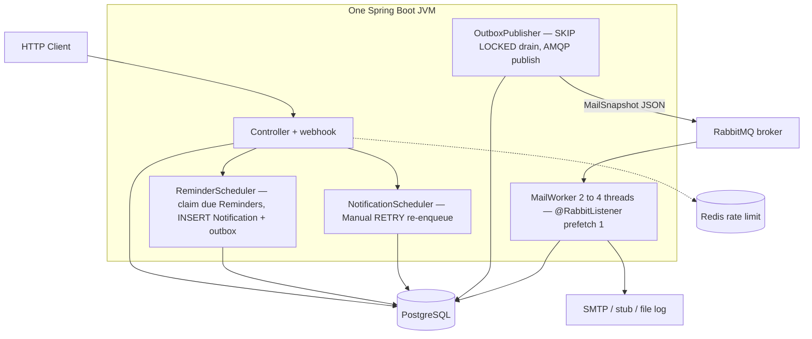
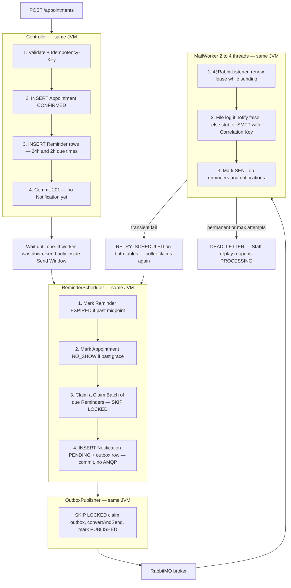
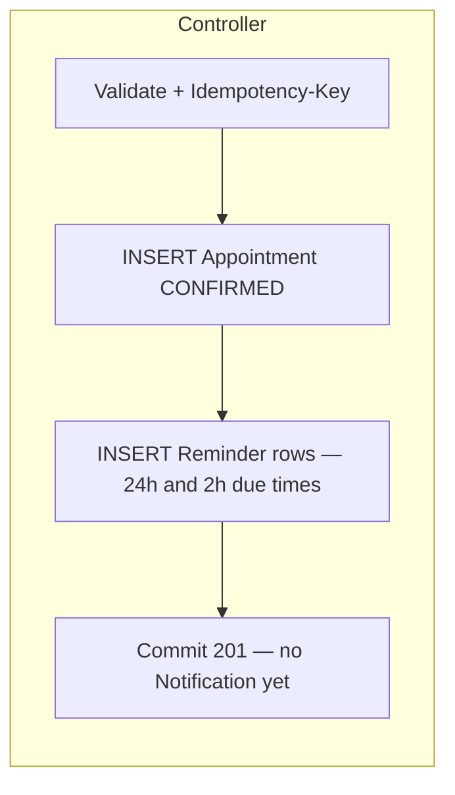
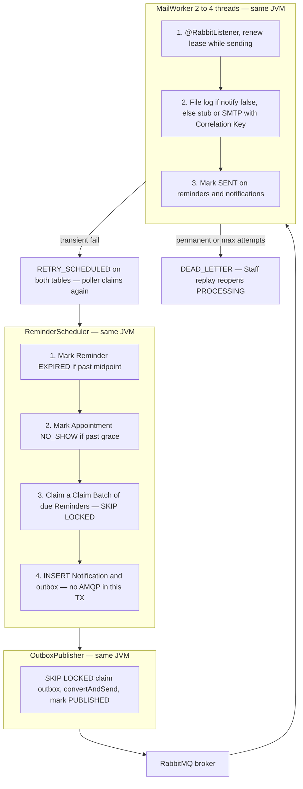
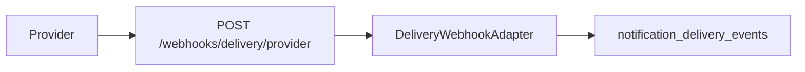

# Architecture: Appointment Booking and Reminder Service

Normative details: [prd/](prd/README.md), [trd/](trd/README.md), [decision/](decision/README.md), [adr/](adr/). Terms: [CONTEXT.md](../CONTEXT.md).

## 1. Shape

**One Spring Boot JVM** on EC2. PostgreSQL, RabbitMQ, and Redis are the other processes. The Reminder poller, Manual retry poller, **OutboxPublisher** (AMQP publish), and **MailWorker** (AMQP consume, 2–4 threads) are **roles in that JVM**, not extra OS processes. Do not draw them as three app boxes.

PostgreSQL is the ledger and the 24h/2h clock. The **controller** writes the Appointment and Reminder schedule (and Manual Notifications). `ReminderScheduler` claims due Reminders and inserts Notification + **Outbox Event** (no AMQP in that transaction). `OutboxPublisher` SKIP LOCKED-drains outbox and `convertAndSend`s to RabbitMQ. `MailWorker` `@RabbitListener`s (prefetch 1) and sends. A **webhook** appends Delivery Events. Redis is HTTP rate limit only.





## 2. Create Appointment



Expired `idempotency_keys` (`expires_at < now()`) are deleted at UTC midnight (`IdempotencyScheduler`). Reuse after TTL is still a new create. Notification `idempotency_key` is not this table.

Outbox rows are **not** written here. Reminders sit in Postgres until they are due. See Due work.

Customer path uses `vehicleId + dealershipId + scheduledAt`. Staff path uses `customerId + vehicleId + scheduledAt` and **home Dealership** from `dealership_staff`. Other Venue is Customer self-book. Take **Booking Offset** from `scheduledAt`; mail uses that. Staff GET formats in **Dealership Timezone**. JVM is UTC so EC2 us-east does not affect India bookings. See [trd/time.md](trd/time.md).

Staff mail status: `GET /appointments/{id}/reminders` (home Dealership) returns **all Schedule Versions**. Reminder rows exist from create. Each item: `scheduleVersion`, `offsetMinutes`, `dueAt` (UTC Instant when that mail should send). Client formats with Dealership Timezone and groups the list as **this visit** then **previous booking** (no version numbers in the UI). Nested `notification` is always present: **Not Scheduled** until a Notification row exists, then the stored status. `lastError` is on that object, not the Appointment.

Shop-wide: `GET /notifications` filters by `notifications.dealership_id`. List and item GET nest the Appointment (customer, Vehicle, visit time) in one `findAllById` batch. Manual compose: `POST /appointments/{id}/notifications` writes the row + `MANUAL_NOTIFICATION` outbox in one transaction (no Reminder). Staff dashboard: `GET /dashboard/stats` calendar year (1 Jan–31 Dec shop TZ) with no `bucket` (totals); last 7 days with `bucket=DAY`. Do not request year-range `DAY` buckets for a 7-day chart.

## 3. Due work

In-memory timers are not the source of truth. After restart, any row with `scheduled_at <= now()` and an eligible status is work. Do not `findAll` due rows into Java.



Expire closed send windows and no-shows with set-based `UPDATE`s (partial indexes), then claim a **Claim Batch** sized from **CPU count** at boot (`APP_WORKERS_CLAIM_BATCH=0` auto; max 50). Floor **18** is the 500k/day drain (`500_000/28_800×2 offsets×0.5s`), not “poll 10×”. Why: [decision/scale.md](decision/scale.md).

Claim SQL shape:

```text
UPDATE reminders
SET status = 'PROCESSING', locked_by = :worker, lease_expires_at = now() + interval '30 seconds'
WHERE id IN (
  SELECT r.id FROM reminders r
  JOIN appointments a ON a.id = r.appointment_id
  WHERE r.status IN ('PENDING','RETRY_SCHEDULED','PROCESSING')
    AND a.status = 'CONFIRMED'
    AND r.scheduled_at <= now()
    AND (r.next_attempt_at IS NULL OR r.next_attempt_at <= now())
    AND (r.lease_expires_at IS NULL OR r.lease_expires_at < now())
    AND now() < r.scheduled_at + (
          COALESCE(
            (SELECT min(r2.scheduled_at) FROM reminders r2
             WHERE r2.appointment_id = r.appointment_id
               AND r2.schedule_version = r.schedule_version
               AND r2.scheduled_at > r.scheduled_at),
            a.scheduled_at)
          - r.scheduled_at) / 2
  ORDER BY r.scheduled_at
  FOR UPDATE SKIP LOCKED
  LIMIT :batch
)
RETURNING *;
```

Same SKIP LOCKED pattern for `outbox_events` and for **Manual** Notification retries (`NotificationLeaseRepository`). Native SQL / JdbcTemplate for clock and claim — not for Notification/outbox row CRUD.

In the same claim transaction, `INSERT` outbox `payload` from a **lean JOIN** (`IN` the claimed ids — appointment id, notification id, dealership id, offset minutes, schedule version, `scheduled_at`, `display_offset`, dealership name, customer name if set, vehicle make/model/year, Vehicle Number, contact, `notify`). Mail worker uses that snapshot; it does not reload the full graph. `notify: false` → append `logs/notifications.log`. `notify: true` → stub or SMTP with Correlation Key = `notifications.id`.

External I/O is **outside** the claim transaction. Renew the lease (heartbeat) while SMTP runs so a slow send is not stolen. A second short transaction records the result. Stale workers must not complete after lease loss (check `locked_by` / version) and must not send if they lost the lease.

## 4. Delivery guarantee

At-least-once processing, unique Notification key:

```text
SYSTEM: appointmentId + ":" + offsetMinutes + ":" + scheduleVersion
MANUAL: appointmentId + ":MANUAL:" + notificationId
```

UNIQUE on `notifications.idempotency_key`. File log, stub, and SMTP all receive that key. SMTP also sets the Correlation Key (`notifications.id`) on a provider-mapped header. Exactly-once mail is not claimed if Brevo accepts and the process dies before SENT.

## 5. Manual send

Staff `POST /appointments/{id}/notifications` `{ subject, body }` (home Dealership, `Idempotency-Key` required). One transaction: insert Notification (`generation=MANUAL`, `channel=EMAIL`, `dealership_id`, `reminder_id` null, subject/body) + `MANUAL_NOTIFICATION` outbox. Publisher and `MailWorker` are the same as System. Manual send takes a **Notification lease** (heartbeat while SMTP runs); transient fail → `RETRY_SCHEDULED` and the Manual poller re-claims when `next_attempt_at` is due. 202 returns the Notification id. `notify: false` on the Appointment does not apply — Manual uses Notification Mode.

## 6. Delivery webhook



Public, Bearer `APP_DELIVERY_WEBHOOK_SECRET`. Adapter maps payload → generic event enum and Correlation Key. Brevo `ts_epoch` is milliseconds (≥ 1e12); seconds still parse. One transaction per POST (array max 100). Insert append-only. Duplicate unique key → no second row. Long `provider_event_id` hashed to 64 hex chars. Do not mutate worker `Notification.status`. Staff item GET returns events latest first. Staff list with `appointmentId` includes the same timeline. Staff list/stats `EXISTS` events. Stats CTE filters healed `occurred_at` to `[from, to)` (epoch ≥ 1e12 still pulled as millis). Bounce/open buckets use first event in range per Notification. Product/tech: [prd/email-tracking.md](prd/email-tracking.md), [trd/email-tracking.md](trd/email-tracking.md).

## 7. Cancellation, reschedule, no-show

- Cancel Confirmed: Customer own or Staff at home Dealership. Appointment `CANCELLED`; unsent Reminders `CANCELLED` in SQL (`UPDATE … WHERE`); no unsend of SENT. Other customer / other shop → 404.
- Staff complete Confirmed: Appointment `COMPLETED`; same Reminder cancel; Vehicle no longer Blocking. Other shop → 404. Customer → 403.
- Reschedule Confirmed: Customer own or Staff at home Dealership. Reject if current visit already past, if new `scheduledAt` is past, or if Instant is unchanged. Cancel unsent Reminders; insert new Reminder rows with `schedule_version = MAX+1` (Reminders own the version; Appointment is not bumped); `INSERT … SELECT` + interval; insert uses send-window midpoint, and skips an offset again only when it was already SENT and the new due is past. SENT Notifications stay. Reminder GET returns **all versions**. Shop Notification list only existing rows. No outbox until new Reminders are due. Other customer / other shop → 404.
- No-show job: set-based SQL `now() >= scheduled_at + interval '1 hour'` → `NO_SHOW_EXPIRED`; Vehicle free for a new Confirmed row.

v1 reads: own or home Dealership, else 404; lists paginated and searchable (`q`). Appointment list Instant `from`/`to` on `scheduled_at`. Staff `GET /notifications` by `dealership_id`. **In Progress** is later.

## 8. Rate limiting

Token bucket in Redis, **one bucket per HTTP endpoint** (method + path; UUID segments collapsed). Identity is `userId` when JWT is present, IP on login/register and other anonymous calls. Login and register do not share tokens. Delivery webhooks are not limited. IP comes from `request.getRemoteAddr()`. `X-Forwarded-For` is used only when `app.rate-limit.trust-forwarded-for` (`APP_RATE_LIMIT_TRUST_FORWARDED_FOR`) is true **and** `RemoteAddr` matches `app.rate-limit.trusted-proxies` (`APP_RATE_LIMIT_TRUSTED_PROXIES`). Empty CIDR list uses Cloudflare published ranges so origin-direct spoofed XFF cannot reset login buckets. Default flag **false**. Every endpoint is **15 requests / 60 seconds** (period never longer than 60s) so a Swagger review is not locked out, except `POST /webhooks/delivery/{provider}` which is not limited. 429 + `X-RateLimit-*` + `Retry-After`. Disabled in tests. Not used for mail and not used for Vehicle uniqueness.

## 9. What scales at 50k/day (sized at 500k)

**Why 500k:** the PDF is 50k Appointments/day / 500 Dealerships; 10× is review headroom (one order of magnitude), not a second multiplier on the poll. **Why CPU-sized pools:** this laptop, Docker, and EC2 do not share cores; guessing Hikari=20 / batch=10 is wrong on every other box. **Why a Claim Batch at all:** `LIMIT 1` / 500ms is 2/s; an 8-hour 500k day with two offsets needs ~35/s; floor **18** is that drain per poll (`500_000/28_800×2×0.5`). Cap 50 so Java never `findAll`s due rows. Hikari `2×CPUs` (Postgres-on-SSD); Tomcat `16×CPUs` capped at Spring’s 200. Mail stays 2–4 because SMTP is the limiter. Kafka is still theatre. Full why: [decision/scale.md](decision/scale.md).

## 10. Demo path

Seed: 1 Dealership, 1 Staff Member, 1 Customer, 2 Vehicles. Default `app.notifications.mode=stub`. Optionally `smtp` + **Brevo**. `notify: false` writes `logs/notifications.log`. Video: POST Appointment → logs → DB rows. Same Idempotency-Key replay is the reliability clip.
