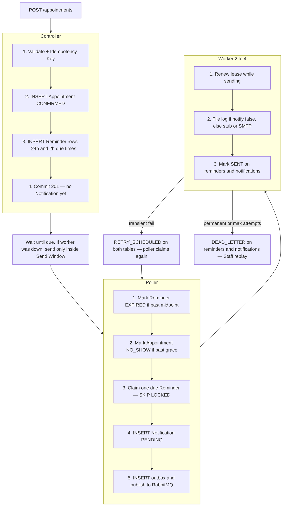
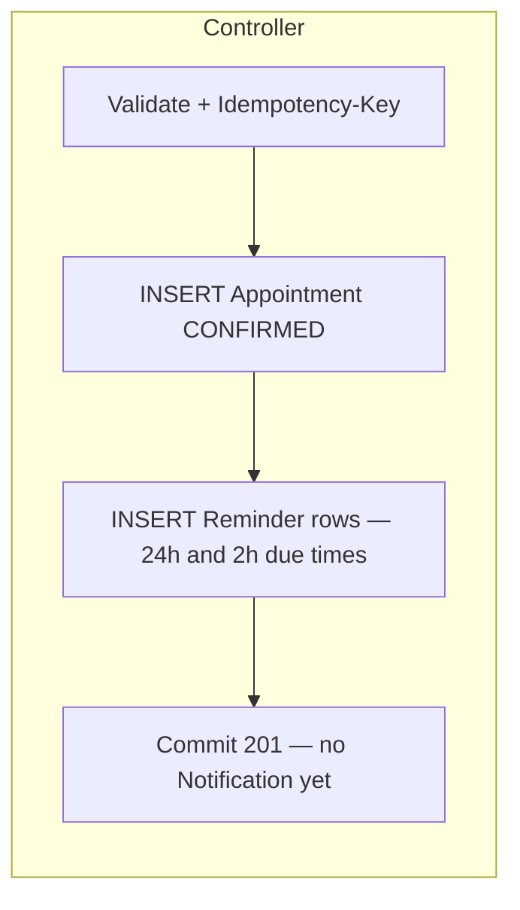
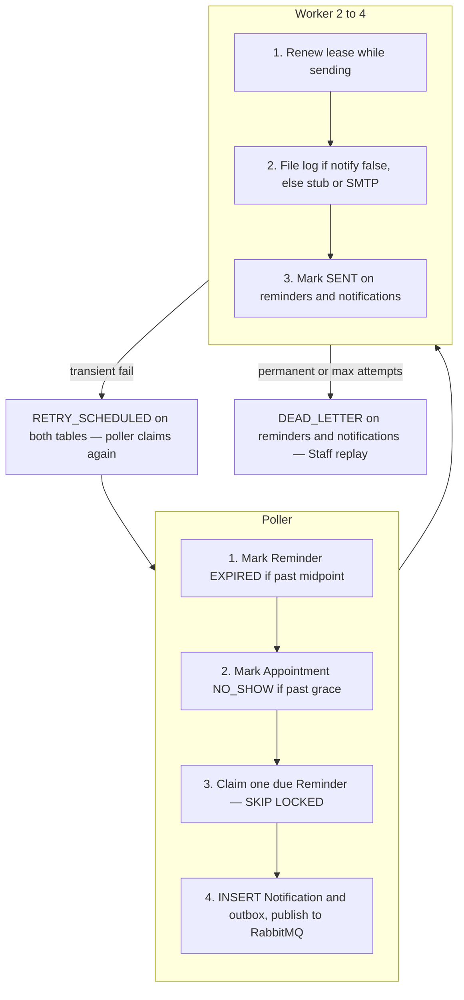

# Architecture: Appointment Booking and Reminder Service

Normative details: [prd/](prd/README.md), [trd/](trd/README.md), [decision/](decision/README.md), [adr/](adr/). Terms: [CONTEXT.md](../CONTEXT.md).

## 1. Shape

One Spring Boot JVM. PostgreSQL is the ledger and the 24h/2h clock. The **controller** writes the Appointment and Reminder schedule. The **poller** claims due Reminders and inserts Notification + outbox. The **worker** (2–4) sends. Redis is HTTP rate limit only.



## 2. Create Appointment



Expired `idempotency_keys` (`expires_at < now()`) are deleted at UTC midnight (`IdempotencyScheduler`). Reuse after TTL is still a new create. Notification `idempotency_key` is not this table.

Outbox rows are **not** written here. Reminders sit in Postgres until they are due. See Due work.

Customer path uses `vehicleId + dealershipId + scheduledAt`. Staff path uses `customerId + vehicleId + scheduledAt` and **home Dealership** from `dealership_staff`. Other Venue is Customer self-book. Take **Booking Offset** from `scheduledAt`; mail uses that. Staff GET formats in **Dealership Timezone**. JVM is UTC so EC2 us-east does not affect India bookings. See [trd/time.md](trd/time.md).

Staff mail status: `GET /appointments/{id}/reminders` (home Dealership). Reminder rows exist from create. Each item: `offsetMinutes`, `dueAt` (UTC Instant when that mail should send). Client formats with Dealership Timezone. Nested `notification` is always present: **Not Scheduled** until a Notification row exists, then the stored status. `lastError` is on that object, not the Appointment.

## 3. Due work

In-memory timers are not the source of truth. After restart, any row with `scheduled_at <= now()` and an eligible status is work. Do not `findAll` due rows into Java.



Expire closed send windows and no-shows with set-based `UPDATE`s (partial indexes), then claim **one** (or a small batch) that is still sendable.

Claim SQL shape:

```text
UPDATE reminders
SET status = 'PROCESSING', locked_by = :worker, lease_expires_at = now() + interval '30 seconds'
WHERE id = (
  SELECT r.id FROM reminders r
  JOIN appointments a ON a.id = r.appointment_id
  WHERE r.status IN ('PENDING','RETRY_SCHEDULED')
    AND a.status = 'CONFIRMED'
    AND r.scheduled_at <= now()
    AND (r.next_attempt_at IS NULL OR r.next_attempt_at <= now())
    AND (r.lease_expires_at IS NULL OR r.lease_expires_at < now())
    AND now() < r.scheduled_at + (
          COALESCE(
            (SELECT min(r2.scheduled_at) FROM reminders r2
             WHERE r2.appointment_id = r.appointment_id
               AND r2.schedule_version = r.schedule_version
               AND r2.scheduled_at > r.scheduled_at),
            a.scheduled_at)
          - r.scheduled_at) / 2
  ORDER BY r.scheduled_at
  FOR UPDATE SKIP LOCKED
  LIMIT 1
)
RETURNING *;
```

Same SKIP LOCKED pattern for `outbox_events`. Native SQL / JdbcTemplate for clock and claim — not for Notification/outbox row CRUD.

In the same claim transaction, `INSERT` outbox `payload` from a **lean JOIN** (appointment id, offset minutes, schedule version, `scheduled_at`, `display_offset`, dealership name, customer name if set, vehicle make/model/year, Vehicle Number, contact, `notify`). Mail worker uses that snapshot; it does not reload the full graph. `notify: false` → append `logs/notifications.log`. `notify: true` → stub or SMTP.

External I/O is **outside** the claim transaction. Renew the lease (heartbeat) while SMTP runs so a slow send is not stolen. A second short transaction records the result. Stale workers must not complete after lease loss (check `locked_by` / version) and must not send if they lost the lease.

## 4. Delivery guarantee

At-least-once processing, idempotent Notification key:

```text
appointmentId + ":" + offsetMinutes + ":" + scheduleVersion
```

UNIQUE on `notifications.idempotency_key`. File log, stub, and SMTP all receive that key. Exactly-once mail is not claimed if Brevo accepts and the process dies before SENT.

## 5. Cancellation, reschedule, no-show

- Cancel Confirmed: Appointment `CANCELLED`; unsent Reminders `CANCELLED` in SQL (`UPDATE … WHERE`); no unsend of SENT.
- Reschedule Confirmed: bump `schedule_version`; old Reminders `CANCELLED`; new Reminder rows via `INSERT … SELECT` + interval; no outbox until those are due.
- No-show job: set-based SQL `now() >= scheduled_at + interval '1 hour'` → `NO_SHOW_EXPIRED`; Vehicle free for a new Confirmed row.

Shop-floor In Progress/Completed is later. v1 reads: own or home Dealership, else 404; lists paginated and searchable (`q`).

## 6. Rate limiting

Token bucket in Redis, **one bucket per HTTP endpoint** (method + path; UUID segments collapsed). Identity is `userId` when JWT is present, IP on login/register and other anonymous calls. Login and register do not share tokens. Every endpoint is **15 requests / 60 seconds** (period never longer than 60s) so a Swagger review is not locked out. 429 + `X-RateLimit-*` + `Retry-After`. Disabled in tests. Not used for mail and not used for Vehicle uniqueness.

## 7. What scales at 75k/day

Average create rate is still low. The spike is many Reminders becoming due in the same minute. Mitigations: **set-based SQL** (no load-all-and-loop), partial indexes, send-window in the claim `WHERE`, lean outbox snapshot, bounded claim batches, **2–4 mail workers** (default 2) with lease heartbeat, two app instances sharing SKIP LOCKED. Do not add Kafka for this load.

## 8. Demo path

Seed: 1 Dealership, 1 Staff Member, 1 Customer, 2 Vehicles. Default `app.notifications.mode=stub`. Optionally `smtp` + **Brevo**. `notify: false` writes `logs/notifications.log`. Video: POST Appointment → logs → DB rows. Same Idempotency-Key replay is the reliability clip.
